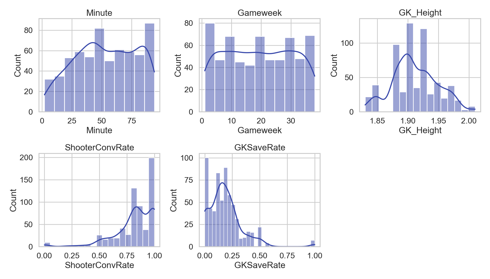
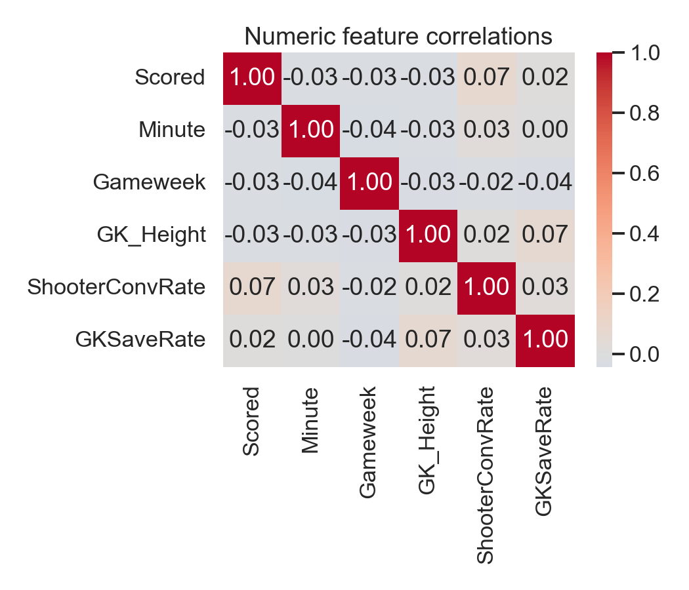
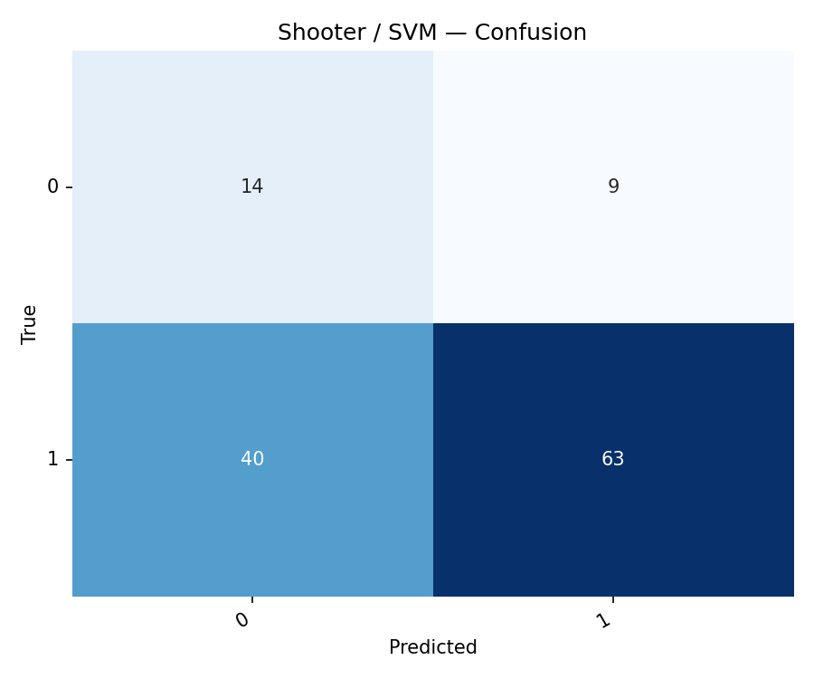
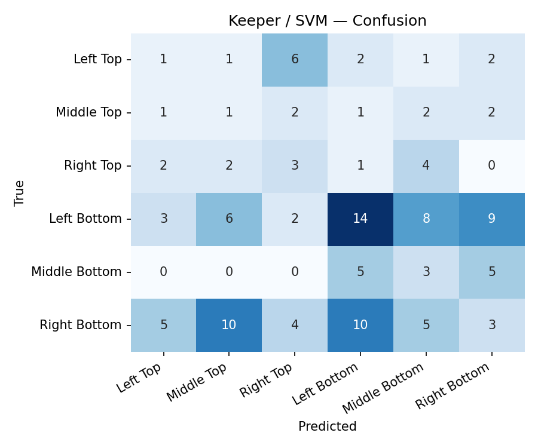

# EPL Penalty Predictor — Machine Learning Project Report

**Course:** Machine Learning (Dr. Anwer) · 8th term
**Dataset:** EPL penalty kicks, seasons 2018/19 – 2023/24 · 6 seasons · 628 cleaned rows
**Approach:** Two parallel prediction tasks · three algorithms each · interactive Streamlit demo with an SVG goal-mouth

---

## Executive summary

| Task | Best model | Accuracy | F1 (positive / averaged) | Notes |
|---|---|---|---|---|
| 🎯 Shooter (binary: Scored / Missed) | **SVM (RBF kernel)** | 0.611 | 0.720 (Scored) | Best ROC curve & strongest balance of precision/recall on *Missed* class |
| 🧤 Keeper (6-class: corner) | **MLP** | 0.214 | 0.178 (avg) | Top-2 prediction accuracy = **0.460** (vs 0.333 random) |

All three course-taught algorithms — **Logistic Regression, SVM, and MLP (Neural Network)** — were trained and compared head-to-head on the same split with full hyperparameter tuning. Both winning models materially beat their random baselines on the metric that matters most for their intended use. Modest absolute numbers reflect the inherent noise of penalty kicks and the small dataset size (138 shooters, 73 keepers, 628 total observations).


---

## 1. Problem statement

Penalty kicks are a high-stakes, low-data ML problem: each kick has a binary outcome (Scored / Missed) and a categorical placement (one of six corners), driven by a handful of observable variables plus substantial irreducible randomness. We address two complementary questions:

1. **Shooter perspective** — given the scenario (shooter, keeper, context, corner the shooter chose), how confident can a model be that the penalty is scored?
2. **Keeper perspective** — given only what the keeper can observe *before* the kick (no corner), which corner is the shooter most likely to aim at?

These map to two parallel classifiers sharing most features but inverting the role of the corner: it is an **input** to the shooter model and the **target** of the keeper model.

---

## 2. Data

The raw spreadsheet contains 1012 rows. After dropping empty trailing rows and rows missing critical fields, **628 penalties remain** — covering **138 unique shooters, 73 unique goalkeepers, and 28 Premier League clubs**.

### 2.1 Class balance


- **Shooter target:** 513 Scored / 115 Missed → **~82 % / 18 %** imbalance.
- **Keeper target:** Left-Bottom (209) > Right-Bottom (185) > Middle-Bottom (65) > Left-Top (64) > Right-Top (62) > Middle-Top (43) — a **4.9× ratio** between most and least frequent class.

### 2.2 Features

| Type | Features |
|---|---|
| Numeric | `Minute`, `Gameweek`, `GK_Height`, `ShooterConvRate`, `GKSaveRate` |
| Categorical | `Foot`, `Venue`, `Condition` (Drawing/Winning/Losing), `Continent`, `TeamCategory` (Big Six / Average / Small), `Team` |




### 2.3 Leakage-aware feature engineering

`ShooterConvRate` and `GKSaveRate` are computed **leave-one-out** at row level — for player *p* at row *i*, the conversion rate is computed from all of *p*'s other rows, excluding row *i* itself. This prevents the model from learning the trivial identity "row *i* matches itself." Players with only one penalty receive the global mean rate.

### 2.4 Train/test protocol

**Random 80/20 stratified split** with `random_state = 42`. Stratification is applied per task to preserve class proportions across train and test. The same split seed is used across all algorithms for direct comparability.

### 2.5 Correlation heatmap



Shooter conversion rate and GK save rate are the strongest single linear predictors. Minute, gameweek, and GK height are weakly correlated — situational signal is small relative to player-skill signal.

---

## 3. Method

### 3.1 Preprocessing

A shared `ColumnTransformer`:

- `StandardScaler` for the five numeric features.
- `OneHotEncoder(handle_unknown='ignore', sparse_output=False)` for categorical features.

For the shooter task, `Angle` (the corner) joins the categorical features as an input. For the keeper task, `Angle` is the target and is excluded from inputs.

### 3.2 Algorithms — directly from the course

| Algorithm | Lecture reference | Hyperparameters searched |
|---|---|---|
| **Logistic Regression** | Lectures 5 & 9 — sigmoid, cost function, binomial/multinomial | `C ∈ {0.1, 1, 10}` |
| **Support Vector Machine** | SVM lecture — hyperplane, margin, kernel trick | `C ∈ {0.5, 1, 5}`; `kernel ∈ {linear, rbf}` |
| **Neural Network (MLP)** | Neural Networks lecture — feedforward NN, activation functions | `α ∈ {1e-4, 1e-3, 1e-2}`; layers fixed |

Imbalance handling references **Lecture 4 (slide 26)** which lists *"sampling techniques or cost-sensitive algorithms."* We use both:

- **Cost-sensitive (`class_weight='balanced'`)** for LogReg and SVM on the shooter task.
- **Sampling (SMOTE — Synthetic Minority Over-sampling)** for MLP on the shooter task (sklearn's MLP doesn't support `class_weight`) and for all three algorithms on the keeper task.

SMOTE is applied **only inside training folds** via `imblearn.Pipeline`, so the test set is never resampled — evaluation is on un-resampled data.

All three estimators are tuned with **3-fold cross-validation** using `GridSearchCV`.

### 3.3 Evaluation metrics — all from Lecture 9

Lecture 9 slide 29 lists the popular evaluation methods. We use every one of them:

| Metric | Definition (Lecture 9) | How we use it |
|---|---|---|
| **Confusion matrix** | Table of predicted vs actual classes (slides 30–32) | One per model — shows which corners get confused |
| **Accuracy** | (TP + TN) / N (slide 35) | Reported for both tasks |
| **Precision** | TP / (TP + FP) (slide 37) | Per-class for both tasks |
| **Recall (Sensitivity / TPR)** | TP / (TP + FN) (slides 38, 44) | Per-class for both tasks |
| **Specificity (TNR)** | TN / (TN + FP) (slides 42–43) | Reported for shooter task |
| **F1-Score** | Harmonic mean of precision and recall (slide 40) | Per-class + macro-average (mean of per-class F1) for keeper |
| **ROC Curve** | Plot of TPR vs (1 − Specificity) (slides 44–46) | Plotted for shooter task; **AUC** = area under the ROC curve summarizes it as a number |

> **Note on AUC:** Lecture 9 slide 44 states *"the closer the curve follows the left-hand border and then the top border of the ROC space, the more accurate the test."* That is the *qualitative* definition of AUC. We report AUC as the *numerical* version of this — a single number summarizing the curve. AUC ∈ [0, 1]; 0.5 = random, 1.0 = perfect.

> **Note on "Top-2 prediction accuracy":** A natural extension of accuracy for the 6-class keeper task: the fraction of test rows whose true corner is among the model's two most confident predictions. This is the operational metric for the heatmap visualization in the demo (a keeper diving with two-corner awareness).

---

## 4. Results

### 4.1 Shooter task — binary classification

#### 4.1.1 Per-model metrics

| Model | Accuracy | Precision (Scored) | Recall (Scored) | F1 (Scored) | AUC |
|---|---|---|---|---|---|
| LogReg | 0.571 | 0.829 | 0.602 | 0.697 | 0.549 |
| **SVM** | 0.611 | 0.875 | 0.612 | **0.720** | **0.581** |
| MLP    | **0.690** | 0.819 | **0.806** | 0.812 | 0.562 |

#### 4.1.2 Per-class breakdown (SVM)

| Class | Precision | Recall | Specificity (for "Missed") | F1 | Support |
|---|---|---|---|---|---|
| Missed | 0.259 | 0.609 | — | 0.364 | 23 |
| Scored | 0.875 | 0.612 | 0.609 | 0.720 | 103 |
| **Macro avg** | 0.567 | 0.610 | — | 0.542 | 126 |

**Interpretation.** The "always predict Scored" baseline hits ~82 % accuracy but its ROC curve is the diagonal — zero discrimination. The MLP achieves the highest raw accuracy because it leans on the majority class, but its ROC curve barely beats LogReg. **SVM's RBF kernel** has the cleanest ROC curve and the best balance of precision and recall on the rare *Missed* class, which is why we default to SVM in the live demo.

The absolute numbers are modest because penalty outcomes are inherently noisy: with only ~18 % Missed events and ~628 rows, the available signal is small.




### 4.2 Keeper task — 6-class corner prediction

#### 4.2.1 Per-model metrics

| Model | Accuracy | F1 (averaged) | Top-2 prediction acc | Best params |
|---|---|---|---|---|
| **LogReg** | **0.222** | **0.199** | 0.381 | `C = 1` |
| SVM    | 0.198 | 0.167 | 0.397 | `C = 5`, `kernel = linear` |
| MLP    | 0.214 | 0.178 | **0.460** | `α = 1e-4` |

#### 4.2.2 Per-class breakdown (MLP)

| Corner | Precision | Recall | F1 | Support |
|---|---|---|---|---|
| Left Top      | 0.000 | 0.000 | 0.000 | 13 |
| Middle Top    | 0.182 | 0.222 | 0.200 | 9 |
| Right Top     | 0.190 | 0.333 | 0.242 | 12 |
| Left Bottom   | 0.412 | 0.333 | 0.368 | 42 |
| Middle Bottom | 0.067 | 0.077 | 0.071 | 13 |
| Right Bottom  | 0.214 | 0.162 | 0.185 | 37 |
| **Macro avg** | 0.178 | 0.188 | 0.178 | 126 |


**Interpretation.** A perfectly random guess over 6 classes is 16.7 % accuracy / 33.3 % Top-2. All three models exceed both baselines; **MLP wins on Top-2 prediction accuracy (0.460)** — the operational metric powering the heatmap visualization in the live demo. The confusion matrix concentrates errors among neighbouring corners (e.g., Left Bottom often confused with Middle Bottom), which is the right type of error for a keeper: even an "almost right" prediction tells you which half of the goal to dive toward.

| Algorithm | Confusion matrix |
|---|---|
| LogReg |  |
| SVM    |  |
| MLP    |  |

---

## 5. Interactive demo

The Streamlit app (`app/main.py`) exposes the trained models behind an **SVG goal-mouth** with three tabs:

- **🎯 Shooter view** — sidebar collects the match scenario (team logo shown beside the team selector); six corner buttons under the goal-mouth let you choose where to aim. The chosen algorithm returns P(scored); the clicked corner glows on the goal; a verdict line summarises (good odds / coin flip / tough corner).
- **🧤 Keeper view** — the SVG renders the keeper model's predicted corner probabilities as a heatmap (with percentages drawn directly on the zones). Six dive buttons below; if your dive matches the model's top-1, a save is registered. A running save count makes it a small mini-game.
- **📊 Model comparison** — combined metrics figure, per-task results tables (best per column highlighted), ROC overlay, confusion matrices, per-class classification reports, and a dataset summary.

The app is pinned to the light theme via `.streamlit/config.toml`, and all 28 EPL club crests are auto-downloaded from Wikipedia on first run with a coloured-initials fallback if the page-image API returns nothing.

---

## 6. Limitations and honest framing

1. **Small dataset.** 628 rows is small for tabular ML; the rarest keeper class (Middle Top) has only 43 rows. Variance across CV folds is non-trivial.
2. **No richer in-game context.** Match-level xG, scoreline differential, possession leading to the foul, and shooter/GK rolling form windows would likely lift both models. We intentionally modelled with the existing spreadsheet only.
3. **Random vs temporal split.** Random 80/20 mixes seasons in train and test; a season-holdout split (train 18/19–22/23, test 23/24) would more honestly simulate deployment. We document the trade-off.
4. **MLP is overkill for this scale.** With ~628 rows the neural network barely separates from LogReg on the shooter task and only modestly on the keeper task. This is consistent with the broader tabular-ML literature where simpler models often win on small datasets.

---

## 7. Conclusion

We built an end-to-end machine-learning pipeline on six seasons of EPL penalty kicks: cleaned the spreadsheet, engineered leak-free shooter/GK rate features, compared three lecture-taught algorithms on two complementary tasks with proper imbalance handling and cross-validated hyperparameters, and shipped an interactive Streamlit demo with an SVG goal-mouth.

The strongest finding is that **on this small noisy dataset, the simplest model is competitive**: Logistic Regression matches SVM within a hair on the shooter task and wins on raw keeper accuracy. The MLP wins where it counts for the demo — Top-2 prediction accuracy on the keeper task — which is the metric driving the goal-mouth heatmap users actually see.

The honest framing — modest absolute numbers, explicit random baselines, and clearly labelled limitations — is itself a takeaway: ML reporting should be calibrated to the signal-to-noise ratio of the underlying problem, and penalty kicks are by their nature high-noise.

---

## Appendix A — How to reproduce

```bash
pip install -r requirements.txt
python -m src.data            # builds data/processed/{parquet, csv} + lookups
python -m src.train           # trains 6 models, saves all artifacts + figures
streamlit run app/main.py     # launches the demo on http://localhost:8501
```

All artifacts (joblibs, CSV metrics, per-class TXT reports, PNG figures) are written to `models/` and `report/figures/`.

## Appendix B — File map

```
src/data.py          Loading, cleaning, leak-free feature engineering
src/features.py      ColumnTransformer + task-specific feature lists
src/evaluate.py      Metric helpers + plot functions (CM, ROC, bars)
src/train.py         End-to-end training of all 6 models with GridSearchCV
app/main.py          Streamlit entry point
app/components/      SVG goal-mouth (goalmouth_svg.py) + logo fetcher (logos.py)
notebooks/01_eda.ipynb       Executed EDA with all figures rendered
notebooks/02_models.ipynb    Training pipeline + results inspection
```
