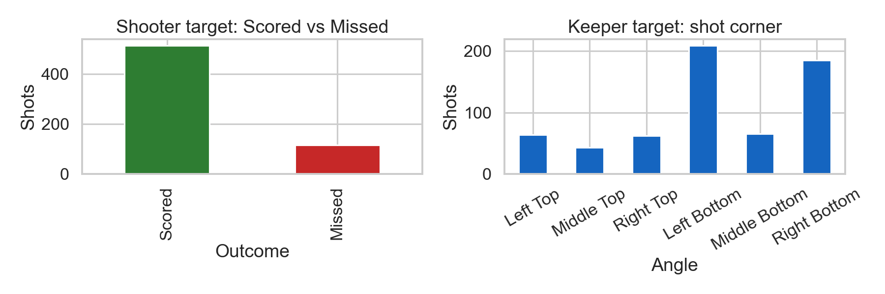
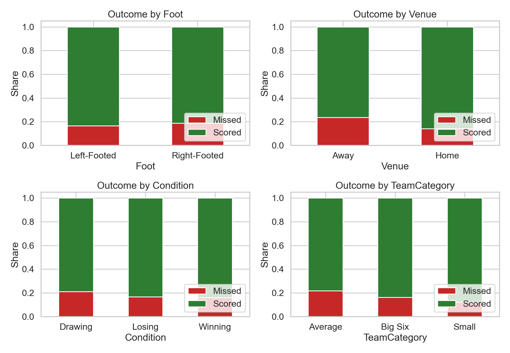
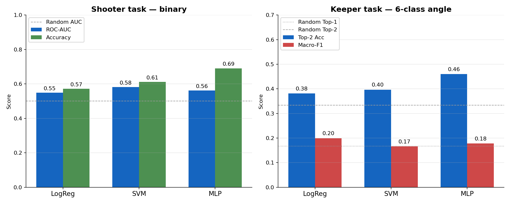
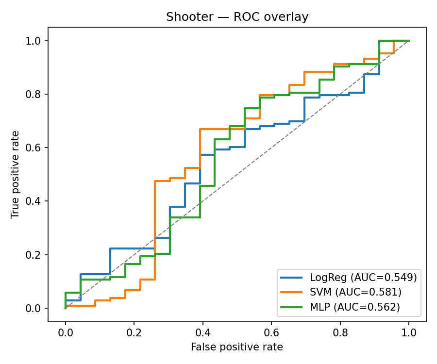
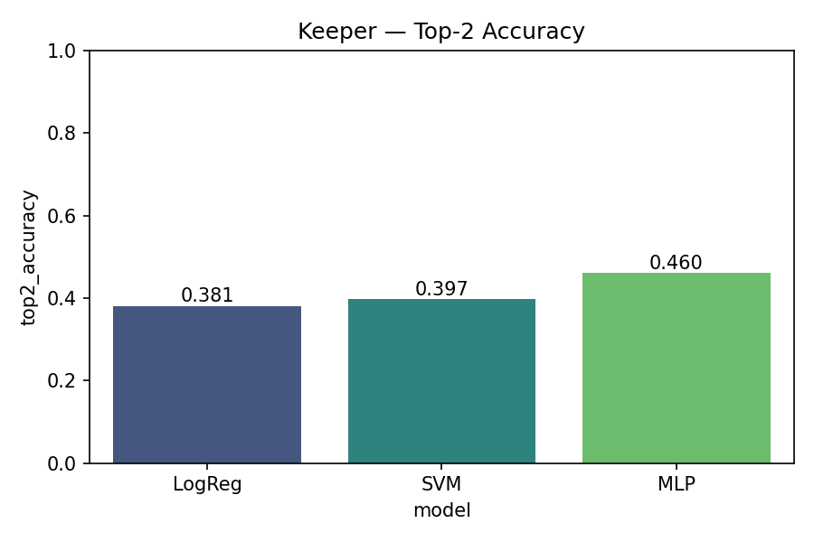
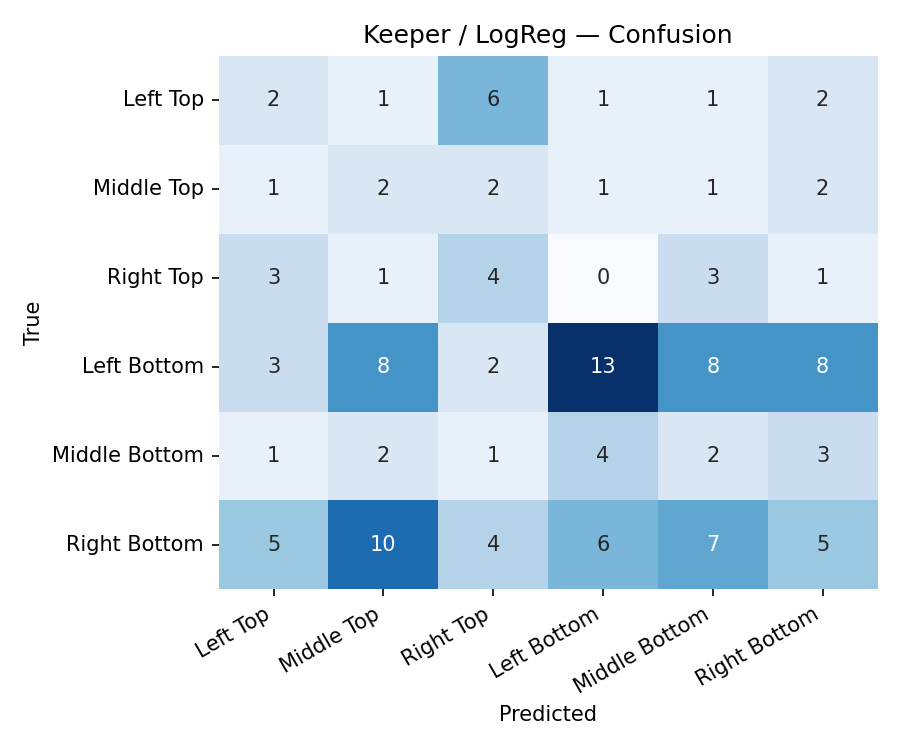
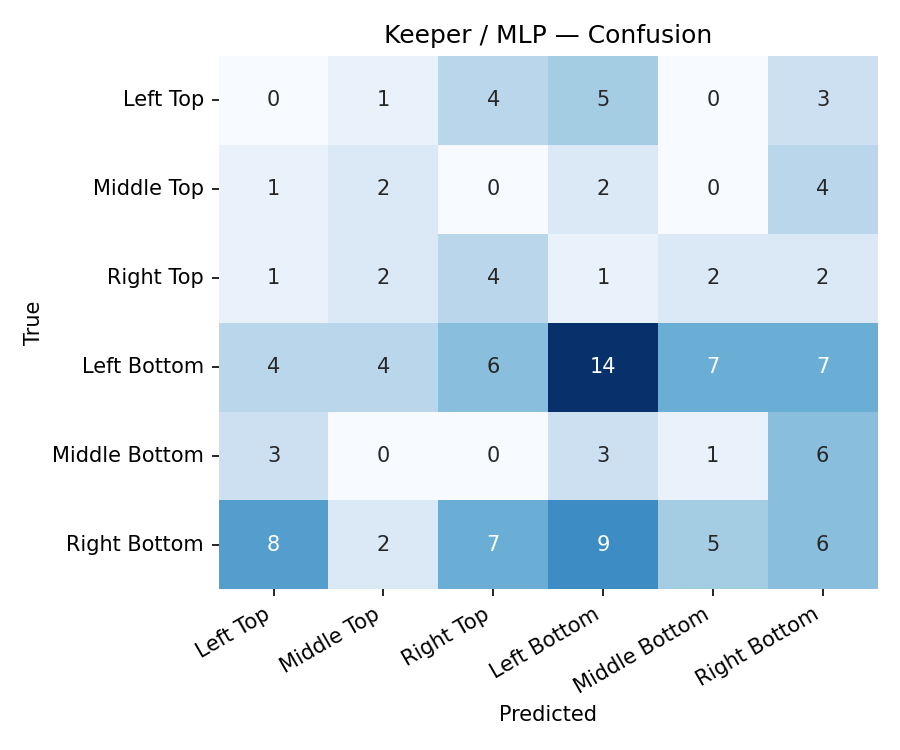

<!-- _class: lead -->

# EPL Penalty Predictor

## Logistic Regression · SVM · Neural Network on 6 seasons of EPL penalties

**Machine Learning · Dr. Anwer · 8th term**

---

## The problem

For every English Premier League penalty kick:

1. **🎯 Shooter task** — *Will the penalty be scored?* (binary classification)
2. **🧤 Keeper task** — *Which corner will the shooter aim at?* (6-class classification)

Two parallel models, sharing most features, **inverting the role of the corner**: it is an **input** to the shooter, the **target** to the keeper.

> Penalty kicks are low-data and high-noise — the right ML question isn't "can we be perfect?" but "can we beat the obvious baseline by a useful margin?"

---

## Dataset at a glance

**6 EPL seasons** (2018/19 – 2023/24)

| | |
|---|---|
| Raw rows | 1012 |
| Clean rows | **628** |
| Shooters | 138 |
| Goalkeepers | 73 |
| Clubs | 28 |
| Scored / Missed | **82 % / 18 %** |
| Corner ratio (max / min) | **4.9 ×** |

---

## Features used

### Numeric

- Minute · Gameweek · GK height
- **Shooter conversion rate** *(leak-free)*
- **GK save rate** *(leak-free)*

### Categorical

- Foot · Venue · Match state
- Continent · Team category · Team
- Corner *(input for shooter / target for keeper)*

---

## Algorithms — all three from the course

| Algorithm | Lecture | Hyperparameter grid |
|---|---|---|
| **Logistic Regression** | Lectures 5 & 9 | `C ∈ {0.1, 1, 10}` |
| **Support Vector Machine** | SVM lecture (linear & RBF kernel) | `C ∈ {0.5, 1, 5}`, `kernel ∈ {linear, rbf}` |
| **Neural Network (MLP)** | Neural Networks lecture | `α ∈ {1e-4, 1e-3, 1e-2}` |

**Imbalance handling** — Lecture 4 slide 26 lists *"sampling techniques or cost-sensitive algorithms"*. We use **both**:

- `class_weight='balanced'` (cost-sensitive) for LogReg / SVM
- **SMOTE** (sampling) for MLP + all keeper models

---

## Method

| Step | Choice |
|---|---|
| **Split** | Random 80/20 stratified, `random_state = 42` |
| **Pipeline** | `StandardScaler` + `OneHotEncoder` → estimator |
| **Tuning** | 3-fold cross-validation via `GridSearchCV` |
| **Leak guard** | Shooter/GK rates computed **leave-one-out** per row |
| **SMOTE safety** | Applied only inside training folds — test set never resampled |

---

## Evaluation metrics — all from Lecture 9

> Lecture 9 slide 29: *"Model Evaluation (Popular Methods)"*

| Metric | Formula | Where used |
|---|---|---|
| Accuracy | (TP + TN) / N | Both tasks |
| Precision | TP / (TP + FP) | Per-class for both |
| Recall (Sensitivity) | TP / (TP + FN) | Per-class for both |
| Specificity (TNR) | TN / (TN + FP) | Shooter task |
| F1-Score | 2·P·R / (P + R) | Per-class + averaged |
| ROC curve | TPR vs (1 − Specificity) | Plotted for shooter |
| **AUC** | Area under the ROC curve | Numeric summary of the ROC plot |

---

<!-- _class: divider -->

# Results

## Two tasks · three algorithms · honest numbers

---

## Headline metrics

---

## Shooter task — Scored vs Missed

| Model | Accuracy | F1 (Scored) | AUC |
|---|---|---|---|
| LogReg | 0.571 | 0.697 | 0.549 |
| **SVM** | 0.611 | **0.720** | **0.581** |
| MLP    | **0.690** | 0.812 | 0.562 |

- **SVM wins on the ROC curve** — best balance of true positives vs false positives.
- **MLP wins on raw accuracy** but mostly by leaning on the majority class.
- Trivial "always Scored" baseline = 82 % acc / 0.500 AUC.

---

## Shooter — per-class (SVM)

| Class | Precision | Recall | F1 | Support |
|---|---|---|---|---|
| Missed | 0.259 | **0.609** | 0.364 | 23 |
| Scored | **0.875** | 0.612 | 0.720 | 103 |
| Macro avg | 0.567 | 0.610 | 0.542 | 126 |

> The `class_weight='balanced'` trade-off: high **recall** on the rare *Missed* class (61 %) at the cost of precision (26 %). That's exactly what we want for honest probability estimates.

---

## Keeper task — 6-class corner

| Model | Accuracy | F1 (averaged) | Top-2 prediction acc |
|---|---|---|---|
| **LogReg** | **0.222** | **0.199** | 0.381 |
| SVM    | 0.198 | 0.167 | 0.397 |
| MLP    | 0.214 | 0.178 | **0.460** |

- Random baseline: **17 % Top-1 / 33 % Top-2**.
- All three models beat both.
- **MLP's Top-2 = 0.46** powers the keeper-view heatmap in the demo.
- "Top-2 prediction accuracy" = extension of accuracy: was the true corner in the model's top two predictions?

---

## Keeper — per-class (MLP)

| Corner | Precision | Recall | F1 | Support |
|---|---|---|---|---|
| Left Top      | 0.000 | 0.000 | 0.000 | 13 |
| Middle Top    | 0.182 | 0.222 | 0.200 | 9 |
| Right Top     | 0.190 | 0.333 | 0.242 | 12 |
| Left Bottom   | 0.412 | 0.333 | 0.368 | 42 |
| Middle Bottom | 0.067 | 0.077 | 0.071 | 13 |
| Right Bottom  | 0.214 | 0.162 | 0.185 | 37 |

> Errors concentrate among **neighbouring corners** — exactly the "almost right" prediction that's still useful for a keeper.

---

## Keeper confusion matrices

LogReg (left) and MLP (right). Both spread errors onto adjacent corners; the bottom row is denser, reflecting the corner-distribution skew in the data.

---

<!-- _class: divider -->

# Live demo

## SVG goal-mouth · Streamlit · Light theme

---

## Demo — Shooter view

- Sidebar collects scenario: team (with crest), shooter, GK, foot, venue, minute, gameweek, match state, algorithm.
- Goal-mouth rendered as **SVG** (gradient sky, white posts, dark net, mowed-grass strip).
- **Six corner buttons** under the goal — click one to fire.
- Model returns **P(scored)**; chosen corner glows yellow; verdict line summarises.
- Switch algorithm in the sidebar to compare LogReg / SVM / MLP **live**.

> Run with:
>
> `streamlit run app/main.py`
>
> 28 EPL crests auto-downloaded from Wikipedia on first run · pinned to light theme via `.streamlit/config.toml`.

---

## Demo — Keeper view

- Keeper model produces the **full 6-corner heatmap** drawn directly on the SVG (percentages on each zone).
- **Click a corner to dive.** Match the model's top-1 prediction → **SAVE**.
- Running **saves / dives** counter — small mini-game built into the demo.
- Side panel shows top-1 and top-2 predictions with confidences.

> Top-2 prediction accuracy of 0.46 (MLP) means in roughly **half of all dives** the model's heatmap puts the right answer in its top two — useful for a keeper who has to commit a half-second early.

---

## Limitations

- **628 rows** is small for tabular ML — rarest keeper class has just 43 rows.
- **Random split** rather than temporal — easier to interpret, slightly optimistic.
- **No in-game context** (xG, scoreline, possession, rolling form) — only the original spreadsheet.
- **MLP doesn't dominate** — consistent with literature for small tabular datasets.

---

## Take-aways

1. **Imbalance handling > algorithm choice** at small scale.
2. **The right metric depends on the operational use** — Top-2 prediction accuracy is what the keeper demo actually needs.
3. **Leak-free feature engineering** is not optional — it changes test-set numbers materially.
4. **A modest, honest result beats an inflated one** — and the SVG demo makes the result memorable.

---

<!-- _class: lead -->

# Thank you

## Code · report · demo all in the repo

**Run it:** `streamlit run app/main.py`

*Questions?*
